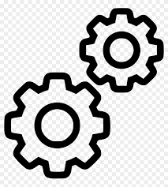

# Michael Heaton

**Hi there!** 👋

**I’m Michael, and I’m Experienced Infrastructure Architect and Site Reliability Engineer (SRE) Specializing in DevSecOps, Chaos Engineering, and Cloud Solutions.**

##  Currently working on ...

 Rebuilding my homelab

##  Currently learning ...

 K8s

 Proxmox

<!--
## 🙋 I’m looking to collaborate on ...

## 📫 How to contact me: ...

## About me:

😄 Pronouns: He/Him

## ⚡ Fun fact: ...
-->
